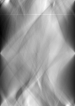
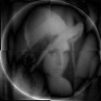

# Recontruction with Radon Transform Algorithm

1. Compile c code: ```./compilegcc RecontructionWithRadonTransform``` 
2. Run executable file: ```./RecontructionWithRadonTransform```
3. Output 4 images: original image, radon transform image, reconstruction image and rotated image(25 degree).
4. Results
<br>




